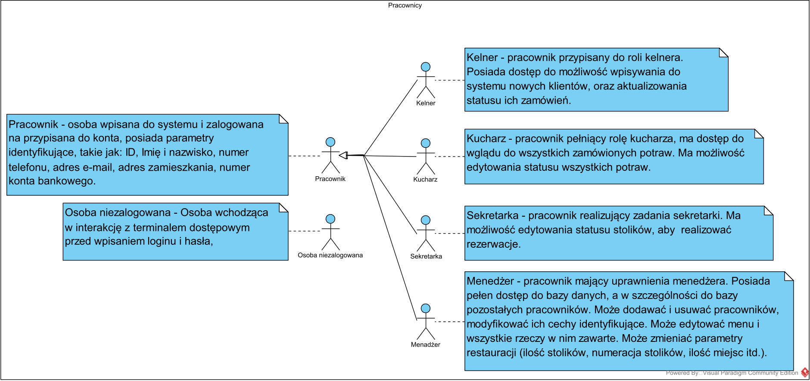
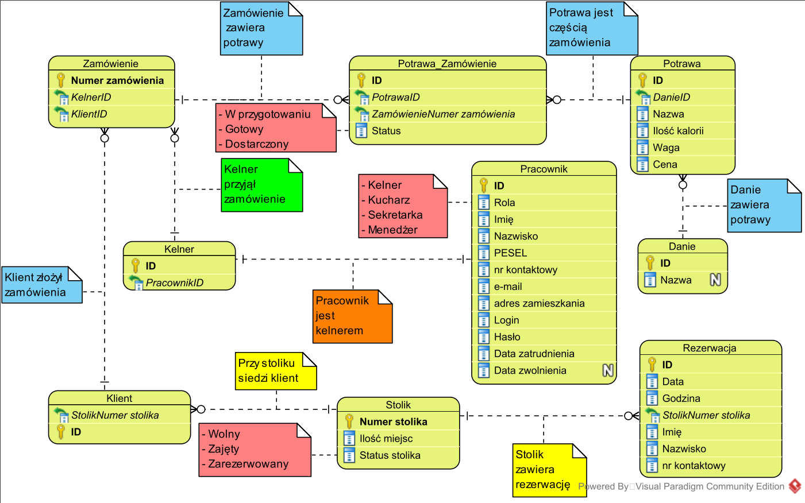
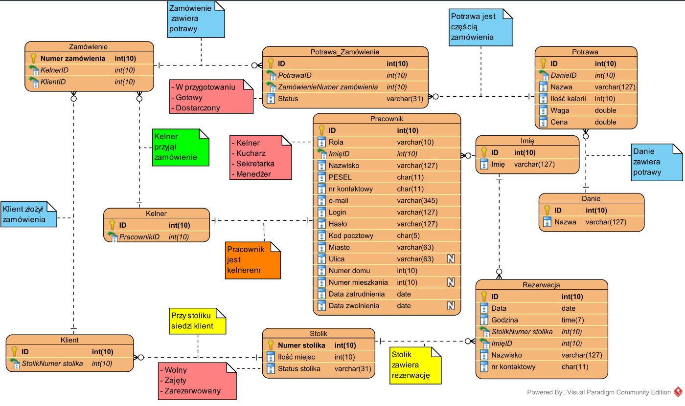

# Restaurant Order Management System

## Overview

This project is designed to streamline order processing and table reservations in a restaurant. The system allows customers to order ready-made dishes and reserve tables via phone, ensuring efficient service and management.

## Features

### For Manager
- Create employee accounts
- Assign and edit employee roles (waiter, receptionist, chef)
- Block employee accounts
- Manage tables (add, deactivate, edit seating)
- Edit menu items and ingredients

### For Waiter
- Manage table reservations
- Update customer status and orders
- Track dish preparation status
- Finalize orders and generate receipts

### For Receptionist
- Handle table reservations
- Update and deactivate reservations
- Add new customers and reservations to the system

### For Chef
- Track and update dish preparation status

## Functional Requirements
- SQL database with a free commercial license
- Local server directly connected to terminals
- User-friendly and accessible terminals for employees
- Secure login with password authentication

## Non-functional Requirements
- Application interface for employee terminals
- High readability and minimal feature set for ease of use
- Concurrent terminal usage without significant delays

## Usage Diagrams

